 

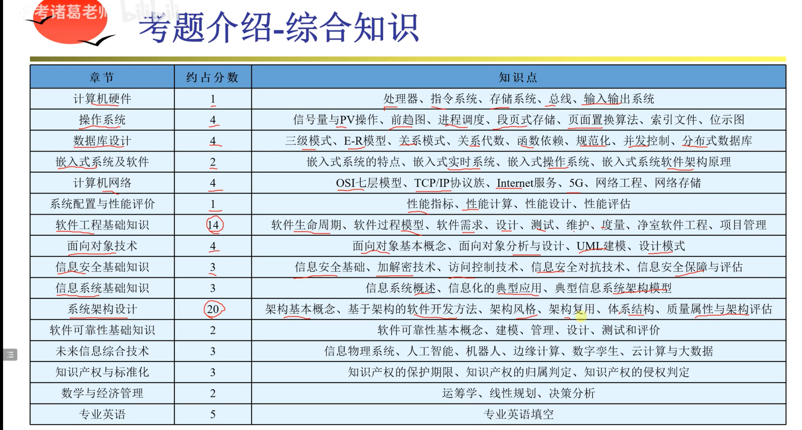

# 操作系统

## 指令集

- CISC（complex instruction set computer）

- RISC（reduce instruction set computer）

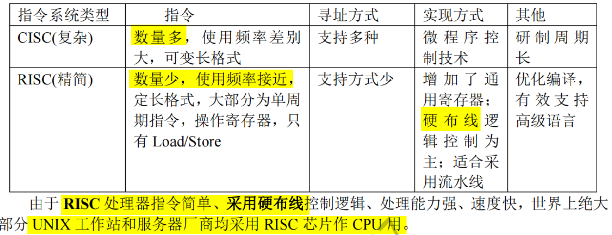

- 指令执行流程
  - 程序计数器（Program Counter, PC）：PC的主要作用是存储下一条要执行的指令的地址。在取指令阶段，CPU会从**PC指向的内存地址**中读取指令。
    - 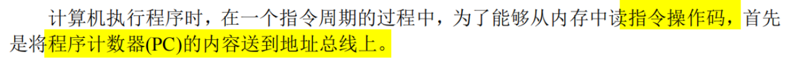
  - 指令寄存器（Instruction Register, IR）
    - PC和IR共同协作以确保指令的连续执行。PC指向下一条要执行的指令的地址，CPU从这个地址中取出指令并将其放入IR中。

- 同步与异步

  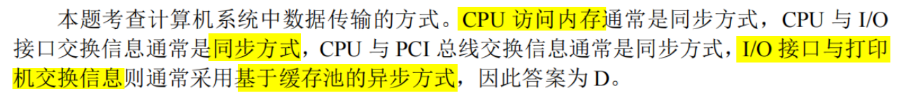

## 存储

- cache

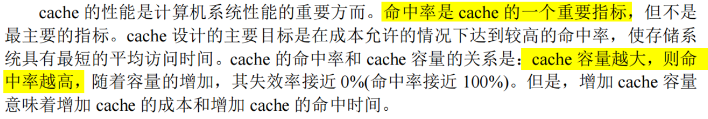

# 计算机网络

# 软件工程

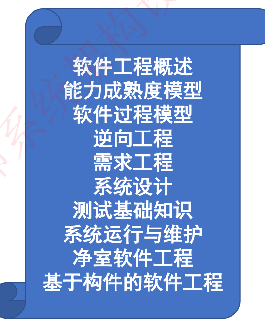

## UML

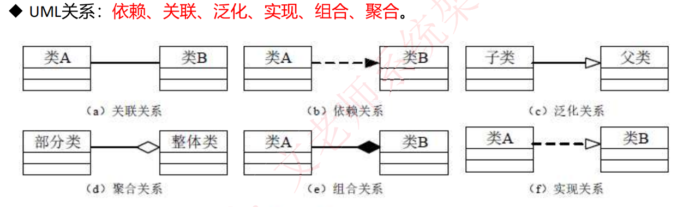

## 项目管理

- PERT
- Gantt

## 4+1架构视图

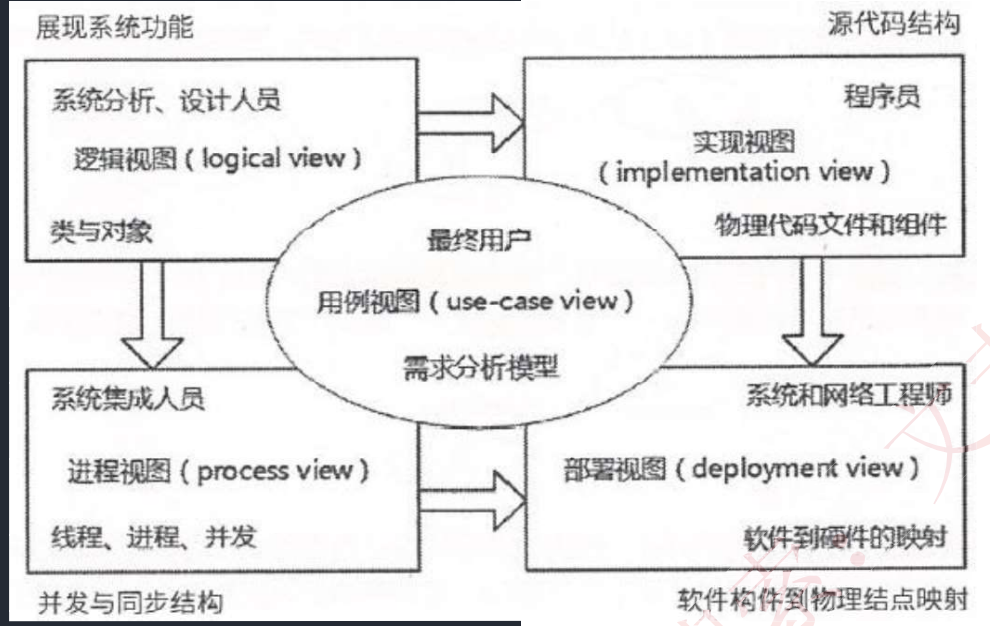

用例视图-- 系统功能

逻辑视图-- 系统内部关系

## 设计模式

## 信息安全

# 架构设计

- 定义

- ADL

- 惯用法

  

## 必背概念

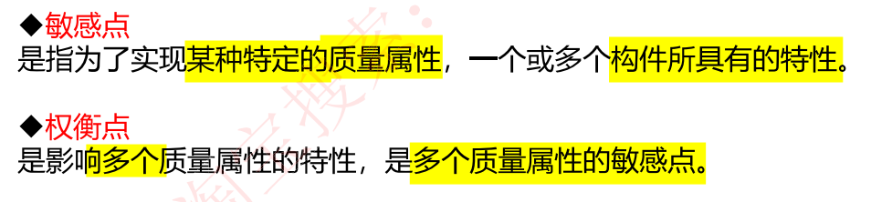

## DSSA

DSSA(Domain-Specific Software Architecture)

## 架构风格

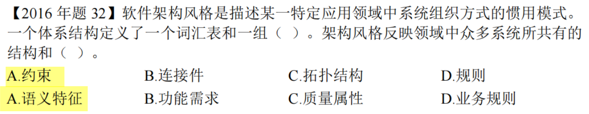

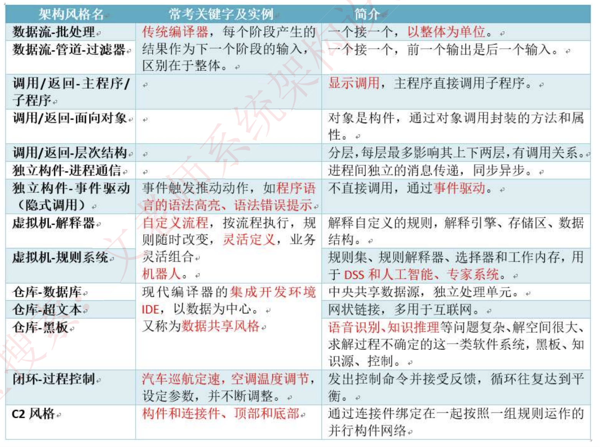

- 虚拟机
  - 一次编译，到处运行；解析内容
  - 解释器：易于扩展，能够对新的定义进行解析
    - 可在运行时对自定义内容进行解析
  - 规则系统：？；人工智能、机器人
- 仓库
  - 中央数据结构说明当前状态，独立构件在中央数据结构上执行
  - 黑板
    - 通过一个共享的、可配置的信息中心——即“黑板”，实现了系统间信息的高效交互与共享。
    - 适用于解决那些没有固定算法的复杂问题，需要多个独立模块共同协作来完成，协作通过黑板完成
  - 数据共享、数据仓库
    - 现代编译器，基于中心语法树作为数据库
- 分层结构
  - 高层抽象，低层实现细节，使系统利于管理

- 主程序/子程序
  - 显示调用，主程序调用子程序
- 面向对象
  - 强调模块化和代码复用，使软件更易扩展和维护，适用于需要可扩展性的复杂系统

- 数据流

  - 管道-过滤器
    - 分阶段数据处理，前面的输出是后面的输入
    - 管道充当数据流的通道，过滤器是这种架构中的基本处理单元

  - 批处理
    - 把数据作为整体处理

- 事件驱动

  - 隐式调用，不直接调用；鼠标键盘操作所引起的、监听函数

  - 回调函数，程序在某个操作完成后执行特定的代码，不需要在等待或阻塞其他任务的执行

- 闭环=过程控制
  - 空调auto风速，几个构件共同协作，适合简单任务

- C2
  - 通过连接件绑定在一起，按照某种规则运作的并行构件网络

## 质量属性

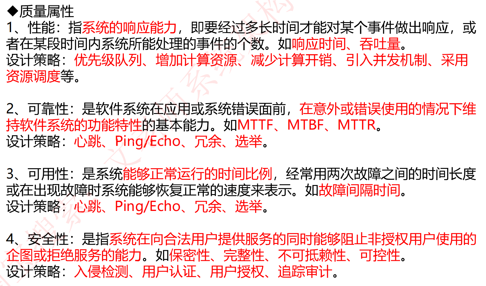

- 可用性&可靠性（优先选择可用性）：
  - Ping/echo 监控组件会向被监控组件发送消息（即"ping"），然后等待并接收回应（即"echo"）
  - 心跳，冗余，选举
- 性能：
  - 优先队列：优先级高的任务先执行
  - 资源调度：提高资源利用利用率，减少任务等待时间
  - 
- 可修改性：
  - 接口-实现&抽象：面向对象的设计
  - 信息隐藏：旨在将特定的信息或设计决策封装在模块的实现中，但不在模块的接口中暴露这些信息，从而使得其他模块无法直接访问到这些被隐藏的信息
  - 
  - 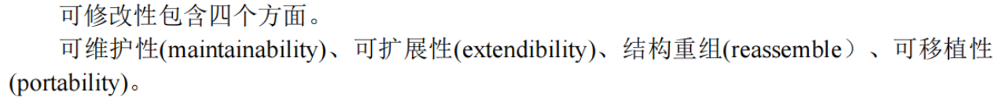
  - **内置监控器**体现了 可测试性**（Testability）和**可维护性**（Maintainability）。可测试性：发现故障并隔离、定位故障的能力。内置监控器可观察和评估软件在运行时的行为，更容易地识别问题所在并进行相应的调试和测试。
  - 记录回放：软件测试中，可能会执行一系列的操作，比如点击按钮、输入数据等。“记录”功能会捕捉这些操作，并保存下来。后续可以重新执行这些操作来验证功能。
- 可测试性：
  - 可以进行错误诊断和调试
- 安全性：
  - 认证、授权
  - 限制访问，两个过程：鉴别，检验主体的合法身份；授权，限制对资源的访问级别
  - 

### 质量属性场景

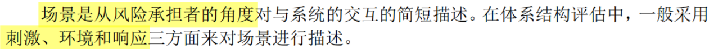

## 架构评估

- 敏感点

  - 构件具有的特性，会影响**一种**质量属性

- 权衡点

  - 构件具有的特性，会影响**多种**质量属性

- 风险点 / 非风险点

  - 是否会引起风险

  

### ATAM

> ATAM（Architecture Tradeoff Analysis Method）架构权衡分析方法 是一种用于软件架构评估的方法

ATAM的核心是**结合质量属性效用树**对系统进行评价

### SAAM

## 面向构件编程

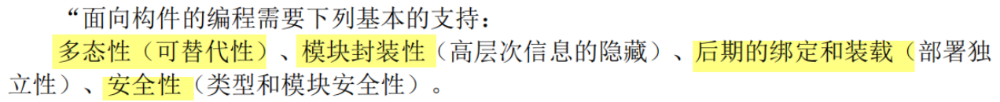

特定领域软件架构

# 嵌入式系统

# Web应用

## 构件

 

## 分布式系统

## C/S

## MVC

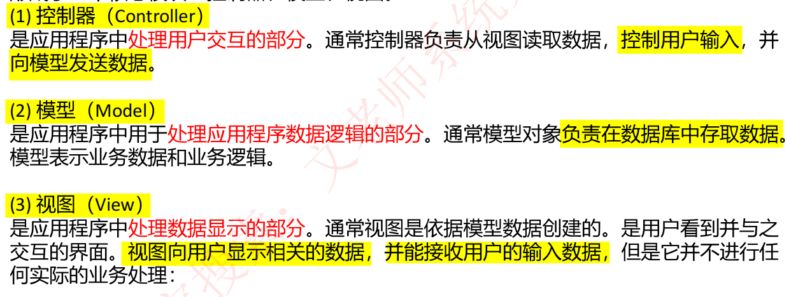

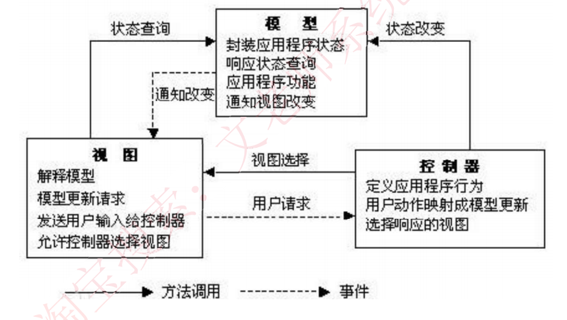

## J2EE

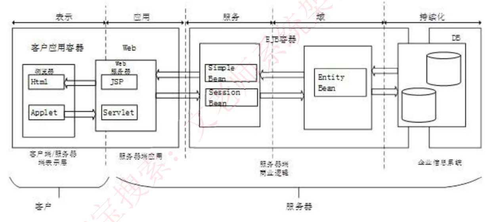

J2EE，全称Java 2 Platform, Enterprise Edition（Java 2平台企业版），是一套用于构建企业级应用的规范和标准

- Servlet
  - Servlet 主要用于处理客户端（如网页浏览器）的请求，并生成响应，这些响应通常是 HTML、XML 或 JSON 格式
  - **请求处理**：每当客户端发送请求到服务器时，Servlet 的 `service()` 方法被调用。`service()` 方法会根据请求的类型（如 GET 或 POST）转发到 `doGet()` 或 `doPost()` 方法。
- JSP（JavaServer Pages）
  - 用于开发动态网页和Web应用程序的技术。允许开发者在HTML页面中嵌入Java代码，这些代码通常被用来动态生成网页内容
- Applets
  - 一种在Java早期发展阶段使用的技术，它们是小型的、可嵌入到网页中的Java程序，可以在支持Java的浏览器中运行。
- EJB（Enterprise JavaBeans）
  - **会话Bean（Session Beans）**：用于封装业务逻辑，可以是无状态的或有状态的
  - **实体Bean（Entity Beans）**：用于表示企业数据，通常与数据库中的表对应

- JDBC（Java Database Connectivity）
  - JDBC API是一个标准SQL数据库访问接口，使数据库开发人员能够用标准Java API编写数据库应用程序，连接各种类型的数据库，执行SQL语句

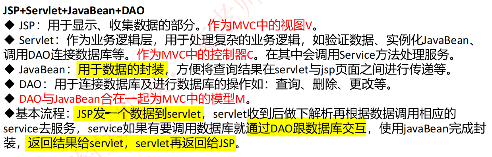

## SOA

面向服务的架构（Service-Oriented Architecture，简称SOA）是一种设计模式，用于构建应用程序，其中应用程序的不同部分（称为服务）通过定义良好的接口和协议进行交互。SOA允许不同的应用程序组件在不同的环境中独立运行，同时仍能协同工作

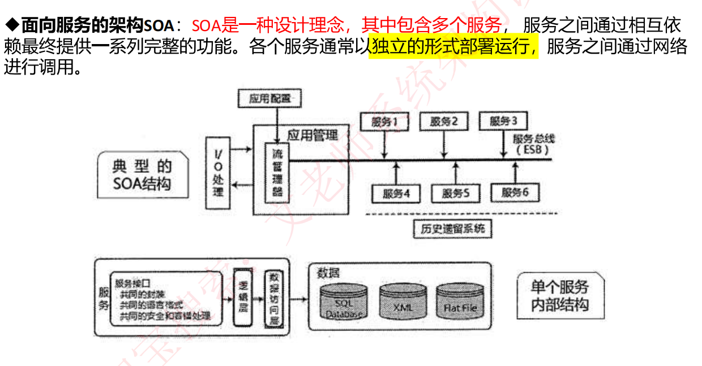

- 企业服务总线（Enterprise Service Bus，简称ESB）

  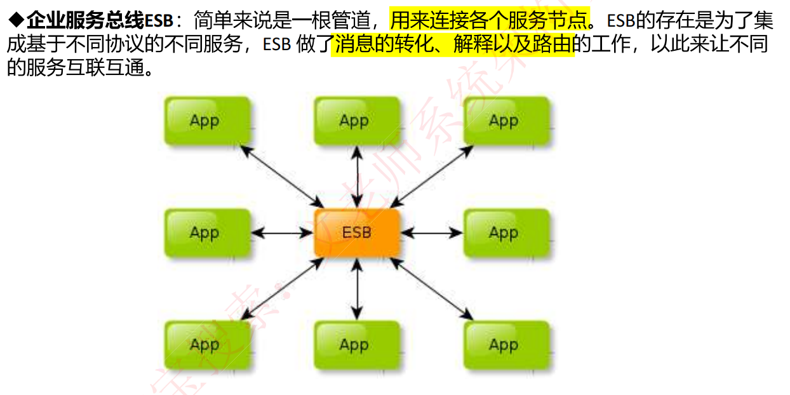

# 数据库

## 范式

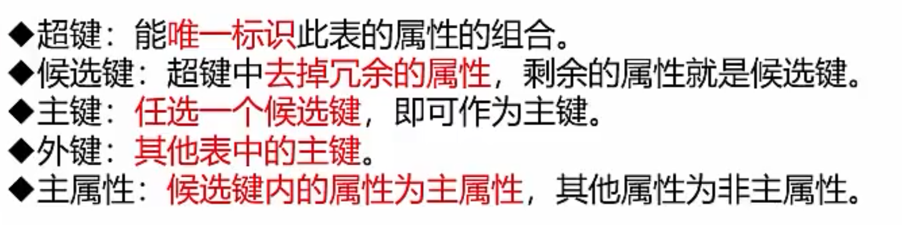

- 候选键：

  

 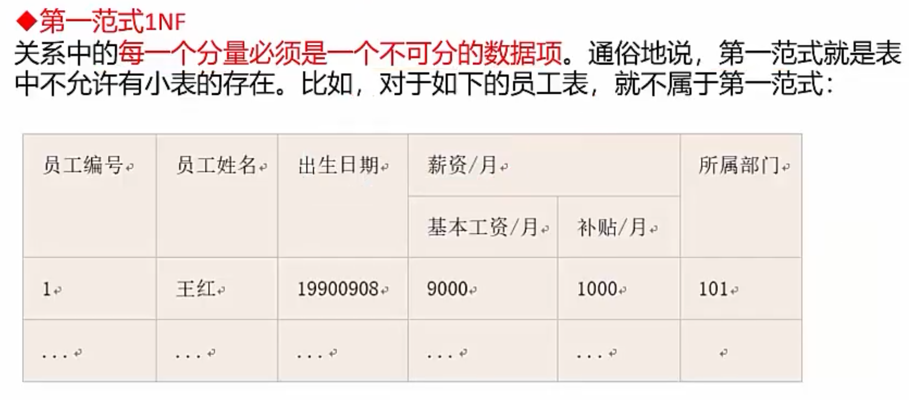

- 1NF

- 2NF
  - 无部分依赖
  - 单主属性

- 3NF
  - 无传递依赖

# ？

虚拟机-解释器
虚拟机-规则系统

CORBA

DSSA、ABSD

视图模型

编译器（Compiler）和解释器（Interpreter）都是编程语言中用于执行代码的工具，但它们在处理代码的方式上有所不同。

**编译器的作用：**
1. **代码转换**：编译器的主要任务是将高级编程语言编写的源代码转换成机器语言或中间代码。这个过程通常包括多个阶段，如词法分析、语法分析、语义分析、优化和代码生成。
2. **性能优化**：编译器可以在编译时进行代码优化，提高程序的执行效率。
3. **错误检测**：在编译过程中，编译器会检查源代码中的语法错误和一些逻辑错误，减少运行时错误的可能性。

**解释器的作用：**
1. **直接执行**：解释器直接读取源代码，并逐行或逐块解释执行，不需要事先编译成机器语言。
2. **动态类型检查**：由于解释器在运行时才解释代码，它可以进行动态类型检查和错误处理。
3. **交互性**：解释器通常支持交互式编程，允许用户逐步执行代码，便于调试和学习。

**编译器和解释器的联系：**
1. **执行代码**：无论是编译器还是解释器，它们的最终目的都是执行源代码。
2. **语言支持**：编译器和解释器都是针对特定编程语言设计的，它们理解并处理该语言的语法和语义。
3. **优化**：现代编译器和解释器都可能包含优化技术，以提高程序的执行效率。

**区别：**
1. **执行时间**：编译器在程序运行前完成所有工作，而解释器在程序运行时进行解释。
2. **启动速度**：由于编译器生成的是直接可执行的机器代码，通常启动速度更快；解释器需要在运行时解释代码，启动速度可能较慢。
3. **灵活性**：解释器由于其动态特性，通常更灵活，可以更容易地支持动态语言特性，如动态类型和运行时代码修改。

在实际应用中，有些语言可能同时拥有编译器和解释器，或者使用一种叫做“即时编译器”（Just-In-Time Compiler，JIT）的技术，它结合了编译器和解释器的特点，先解释执行，然后在运行时将热点代码编译成机器代码以提高效率。