# 操作系统

# 数据库

# 计算机网络

# 软件工程

# UML

## 4+1架构视图

用例视图-- 系统功能

逻辑视图-- 系统内部关系

# 设计模式

# 架构

- 定义

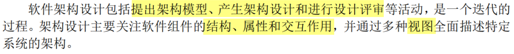

- ADL

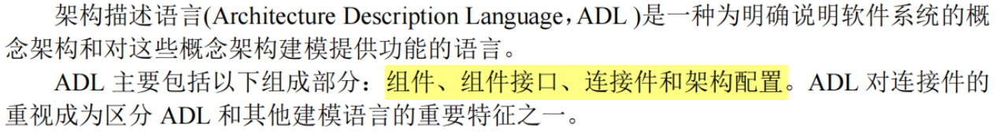

- 惯用法

  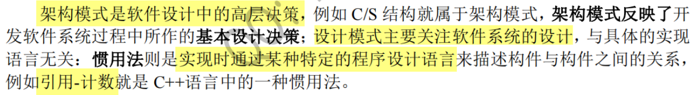

## DSSA

DSSA(Domain-Specific Software Architecture)

## 架构风格

- 虚拟机
  - 一次编译，到处运行；解析内容
  - 解释器：易于扩展，能够对新的定义进行解析
    - 可在运行时对自定义内容进行解析
  - 规则系统：？；人工智能、机器人
- 仓库
  - 中央数据结构说明当前状态，独立构件在中央数据结构上执行
  - 黑板
    - 通过一个共享的、可配置的信息中心——即“黑板”，实现了系统间信息的高效交互与共享。
    - 适用于解决那些没有固定算法的复杂问题，需要多个独立模块共同协作来完成，协作通过黑板完成
  - 数据共享、数据仓库
    - 现代编译器，基于中心语法树作为数据库
- 分层结构
  - 高层抽象，低层实现细节，使系统利于管理

- 主程序/子程序
  - 显示调用，主程序调用子程序
- 面向对象
  - 强调模块化和代码复用，使软件更易扩展和维护，适用于需要可扩展性的复杂系统

- 数据流

  - 管道-过滤器
    - 分阶段数据处理，前面的输出是后面的输入
    - 管道充当数据流的通道，过滤器是这种架构中的基本处理单元

  - 批处理
    - 把数据作为整体处理

- 事件驱动

  - 隐式调用，不直接调用；鼠标键盘操作所引起的、监听函数

  - 回调函数，程序在某个操作完成后执行特定的代码，不需要在等待或阻塞其他任务的执行

- 闭环=过程控制
  - 空调auto风速，几个构件共同协作，适合简单任务

- C2
  - 通过连接件绑定在一起，按照某种规则运作的并行构件网络

## 质量属性

- 可用性&可靠性（优先选择可用性）：
  - Ping/echo 监控组件会向被监控组件发送消息（即"ping"），然后等待并接收回应（即"echo"）
  - 心跳，冗余，选举
- 性能：
  - 优先队列：优先级高的任务先执行
  - 资源调度：提高资源利用利用率，减少任务等待时间
  - 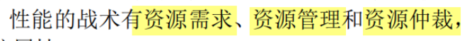
- 可修改性：
  - 接口-实现&抽象：面向对象的设计
  - 信息隐藏：旨在将特定的信息或设计决策封装在模块的实现中，但不在模块的接口中暴露这些信息，从而使得其他模块无法直接访问到这些被隐藏的信息
  - 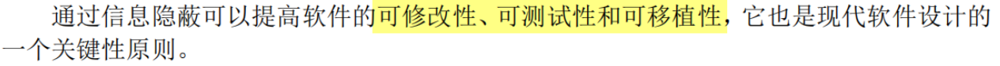
  - 
  - **内置监控器**体现了 可测试性**（Testability）和**可维护性**（Maintainability）。可测试性：发现故障并隔离、定位故障的能力。内置监控器可观察和评估软件在运行时的行为，更容易地识别问题所在并进行相应的调试和测试。
  - 记录回放：软件测试中，可能会执行一系列的操作，比如点击按钮、输入数据等。“记录”功能会捕捉这些操作，并保存下来。后续可以重新执行这些操作来验证功能。
- 可测试性：
  - 可以进行错误诊断和调试
- 安全性：
  - 认证、授权
  - 限制访问，两个过程：鉴别，检验主体的合法身份；授权，限制对资源的访问级别
  - 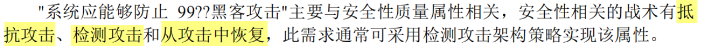

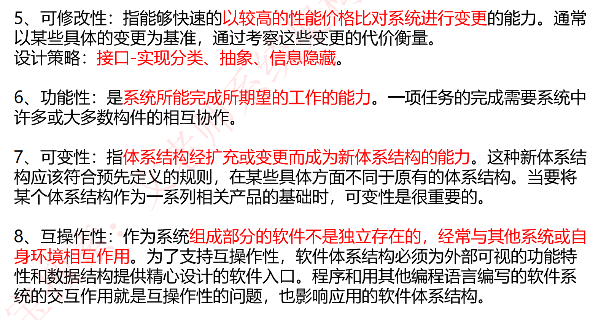

### 质量属性场景

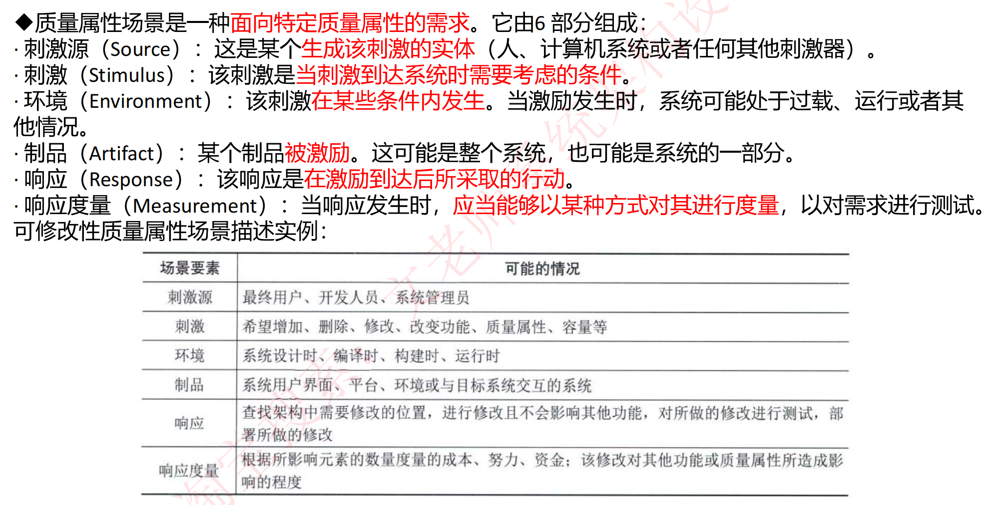

## 架构评估

- 敏感点

  - 构件具有的特性，会影响**一种**质量属性

- 权衡点

  - 构件具有的特性，会影响**多种**质量属性

- 风险点 / 非风险点

  - 是否会引起风险

  

### ATAM

> ATAM（Architecture Tradeoff Analysis Method）架构权衡分析方法 是一种用于软件架构评估的方法

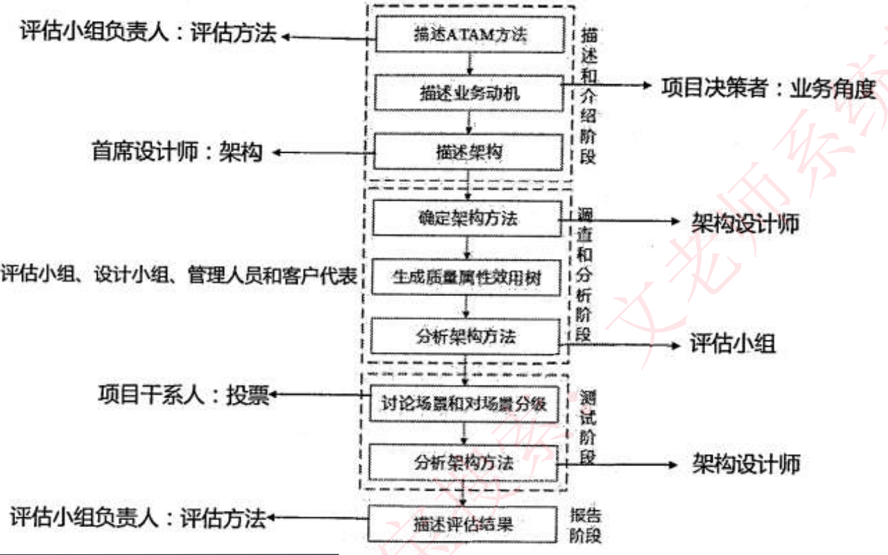

ATAM的核心是**结合质量属性效用树**对系统进行评价

### SAAM

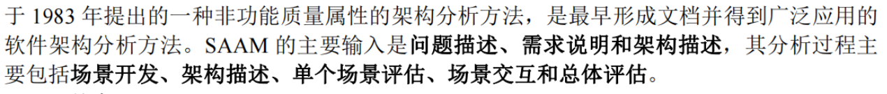

## 面向构件编程

特定领域软件架构

# 分布式系统

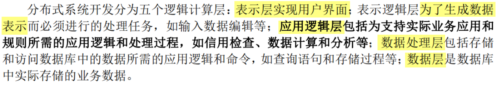

# 嵌入式系统

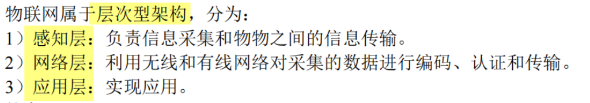

# Web

## J2EE

J2EE，全称Java 2 Platform, Enterprise Edition（Java 2平台企业版），是一套用于构建企业级应用的规范和标准

# ？

虚拟机-解释器
虚拟机-规则系统

视图模型

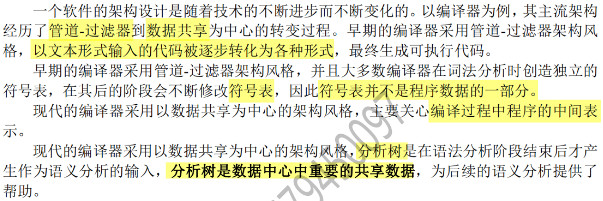